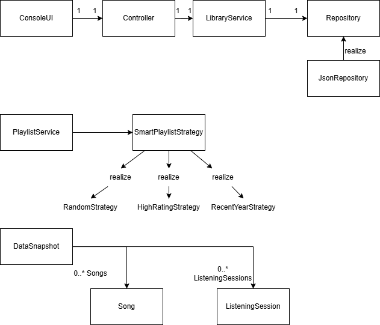

# BeatLog – Musiktracking-Applikation

## Beschreibung der Applikation
BeatLog ist eine objektorientierte Java-Applikation zur Verwaltung und Analyse von Songs und Hörsessions.  
Die Software ermöglicht es, Songs anzulegen, zu bearbeiten, zu löschen und das persönliche Hörverhalten zu protokollieren.  
Darüber hinaus können smarte Playlists automatisch anhand von Kriterien (z. B. Stimmung oder Bewertung) generiert werden.

Die Applikation folgt einem mehrschichtigen Architekturmodell:
- UI-Schicht (ConsoleUI): Benutzerinteraktion über Konsolenmenü  
- Controller-Schicht: Vermittelt Eingaben an die Fachlogik  
- Service-Schicht: Enthält die Geschäftslogik für Songs, Sessions und Playlists  
- Persistence-Schicht: Verantwortlich für das Laden und Speichern der Daten  
- Domain-Schicht: Definiert die zentralen Datenklassen wie `Song`, `ListeningSession` und `DataSnapshot`

---

## UML-Diagramm

Das Klassendiagramm zeigt die Struktur der Applikation, die Schichtentrennung, sowie eingesetzte Design-Patterns  
(Repository Pattern und Strategy Pattern).

Klassendiagramm:



## Zentrale UML-Elemente

| Elementtyp | Klassen / Interfaces | Beschreibung |
|-------------|----------------------|---------------|
| Interface | `Repository`, `SmartPlaylistStrategy` | Definiert gemeinsame Schnittstellen für Speicherung und Playliststrategien |
| Klassen (Domain) | `Song`, `ListeningSession`, `DataSnapshot` | Datenobjekte für Songs, Sessions und Snapshots |
| Service-Klassen | `LibraryService`, `PlaylistService` | Enthalten die Logik zur Verwaltung von Songs, Sessions und generierten Playlists |
| Controller / UI | `Controller`, `ConsoleUI` | Vermitteln zwischen Benutzer und Fachlogik |
| Persistenz | `JsonRepository` | Implementiert die Datenspeicherung in JSON |
| Hilfsklassen | `ValidationException`, `Ids`, `Result<T>` | Inputvalidierung, ID-Erzeugung und generische Rückgabewerte |

---

## Design Patterns

1. Repository Pattern  
   → `Repository` (Interface) und `JsonRepository` (Implementierung)  
   Trennung von Datenzugriff und Logik, um Austauschbarkeit des Speichermediums zu ermöglichen.

2. Strategy Pattern  
   → `SmartPlaylistStrategy` + `RandomStrategy`, `HighRatingStrategy`, `RecentYearStrategy`  
   Auswahl verschiedener Algorithmen zur Playlist-Erzeugung zur Laufzeit.

---

## Polymorphie und Vererbung
Polymorphie wird durch die Verwendung der Strategien ermöglicht:
```java
SmartPlaylistStrategy strategy = new HighRatingStrategy();
List<Song> playlist = strategy.generate(allSongs);
```

# Beatlog – Demo-Ablauf (alle Use Cases)

## 1️. Songs anzeigen
Ziel: Startübersicht zeigen  
Schritte:
1. Starte das Programm.  
2. Wähle `1) Songs anzeigen`.  
3. Zeig, dass alle gespeicherten Songs (mit Mood, Rating usw.) geladen werden.  

Erklärung:  
 „Hier sehe ich alle Songs, die aktuell in meiner Beatlog-Datenbank gespeichert sind.“

---

## 2. Song anlegen
Ziel: neuen Song hinzufügen  
Schritte:
1. Wähle `2) Song anlegen`.  
2. Gib Daten ein (z. B. Titel, Künstler, Stimmung, Bewertung, Tag).  
3. Zeig, dass der Song nachher in der Liste angezeigt wird.  

Erklärung:  
 „Ich kann jederzeit neue Songs hinzufügen und sie mit Moods oder Tags versehen.“

---

## 3. Song bearbeiten
Ziel: bestehenden Song verändern  
Schritte:
1. Wähle `3) Song bearbeiten`.  
2. Ändere z. B. Rating von 7 auf 9.  
3. Zeig die aktualisierte Liste.  

Erklärung:  
 „Falls ich meine Meinung ändere, kann ich Songs bearbeiten, z. B. Bewertung oder Stimmung.“

---

## 4️. Song löschen
Ziel: Songs entfernen  
Schritte:
1. Wähle `4) Song löschen`.  
2. Wähle einen Song und bestätige.  
3. Zeig, dass der Song aus der Liste verschwindet.  

Erklärung:  
 „Songs, die ich nicht mehr loggen will, kann ich einfach löschen.“

---

## 5️. Session loggen
Ziel: eine Musiksitzung erfassen  
Schritte:
1. Wähle `5) Session loggen`.  
2. Gib ein Datum + Song oder Playlist an.  
3. Session wird gespeichert.  

Erklärung:  
 „Hier kann ich festhalten, wann und was ich gehört habe – zum Beispiel fürs Training oder beim Lernen.“

---

## 6️. Sessions anzeigen
Ziel: gespeicherte Sessions sehen  
Schritte:
1. Wähle `6) Sessions anzeigen`.  
2. Zeig, dass alle bisherigen Sessions mit Datum und Songs erscheinen.  

Erklärung:  
 „Damit kann ich nachvollziehen, welche Songs ich wann gehört habe.“

---

## 7️. Songs filtern (Mood/Rating/Tag)
Ziel: gezielt Songs suchen  
Schritte:
1. Wähle `7) Songs filtern`.  
2. Filtere z. B. nach Mood = *Happy* oder Rating ≥ 8.  
3. Zeig die gefilterte Liste.  

Erklärung:  
 „Ich kann Songs nach Stimmung, Bewertung oder Tags filtern, um gezielt passende Musik zu finden.“

---

## 8️. Smarte Playlist generieren
Ziel: automatisch eine Playlist erstellen  
Schritte:
1. Wähle `8) Smarte Playlist generieren`.  
2. App analysiert Songs (Mood, Rating) und erstellt automatisch eine Playlist.  
3. Zeig, welche Songs ausgewählt wurden.  

Erklärung:  
 „Beatlog kann selbst eine Playlist generieren – zum Beispiel mit meinen Lieblingssongs oder nach Stimmung.“

---

## 9️. Backup exportieren (alle Daten)
Ziel: Sicherung der Songs und Sessions  
Schritte:
1. Wähle `9) Backup exportieren`.  
2. App speichert alle Daten (z. B. als JSON-Datei).  

Erklärung:  
 „Damit kann ich meine gesamte Musik-Datenbank sichern – praktisch, falls ich sie mal übertragen möchte.“

---

## 10. Backup importieren (alle Daten)
Ziel: gespeichertes Backup wiederherstellen  
Schritte:
1. Wähle `10) Backup importieren`.  
2. App lädt die zuvor exportierte Datei.  
3. Zeig, dass alle Songs und Sessions wieder sichtbar sind.  

Erklärung:  
 „Wenn ich ein Backup habe, kann ich alles wiederherstellen – Songs, Bewertungen und Sessions bleiben erhalten.“
